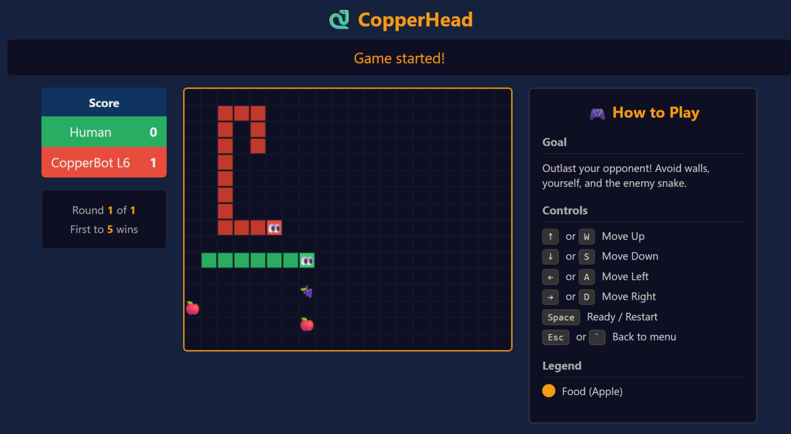

# CopperHead Server

Version: 3.4.0

A server for a 2-player Snake game. The CopperHead server manages game state and multi-round knockout competitions, communicating with human and robot clients via WebSocket API.

## Quick Start: Play CopperHead

1. **Launch the CopperHead server in CodeSpaces**: Click the green **Code** button on this repository page, select the **Codespaces** tab, and click **Create codespace on main**. The server will start after a few minutes.

    - When prompted, click **Make Public** so players can connect.

    

2. **Click the link** displayed in README.md (visible in the Explorer panel after startup). This opens the client with your server already connected.

    

3. **Play** vs a friend or a bot
    - Click **Join** and invite a friend to do the same on this server
    - Or, click **Play Bot** to join and add a bot opponent automatically

    

## About CopperHead Server

CopperHead Server is responsible for managing game state, player matchmaking, and competition logic for a multi-round CopperHead tournament among human and/or AI players.

CopperHead Server does not provide any user interface or graphics for playing the game. Human players use [CopperHead Client](../copperhead-client/) to play or observe games. Bots (automated players) connect via the WebSocket API.

This server can launch basic bot opponents, but better strategies are possible. To **build your own bot opponent**, see [Building-Your-Own-Bot.md](Building-Your-Own-Bot.md) for instructions.

### Game Rules

CopperHead is a 2-player game played on a rectangular grid. Each player controls a snake that moves around the grid, trying to eat food items to grow longer while avoiding collisions with walls, themselves, and the other player's snake. 

See [Game Rules](game-rules.md) for full details on game mechanics and scoring.

### Winning a Match

A Match of CopperHead consists of multiple games. The player who survives the game wins a point. The first player to reach a predefined number of points wins the match.

## CopperHead Tournaments

The CopperHead server is designed to host a knockout tournament among human and/or AI players to determine the Championship winner. See [Competition Logic](competition-logic.md) for full details on how competitions are structured and run.

Hosting a CopperHead Bot Hack Tournament is a fun way to engage friends or colleagues in coding AI opponents to compete in CopperHead. See [How-To-Host-A-Bot-Hack-Tournament.md](How-To-Host-A-Bot-Hack-Tournament.md) for step-by-step instructions.

## Server Reference

Usage: python main.py [options] [spec-file]

* `spec-file`: Optional path to a JSON configuration file. If no arguments are provided, `server-settings.json` is used if it exists.

If the configuration file is modified while the server is running, the server will automatically load the new settings, cancel all active games and restart the competition.

### Command-Line Options

Instead of using a spec file, you may provide command-line options. These options override any settings in the spec file.

* `--arenas`: Number of matches in round 1 of the competition. The default is 1, which is best for a single player vs one human or AI opponent. The competition will not begin until twice the number of players have joined.

* `--points-to-win`: Number of points required to win a match. Default is 5.

* `--reset-delay`: Once a competition is complete, the server will wait this many seconds before resetting. At reset the competition restarts: active bots are terminated, new bots are launched according to the `--bots` setting, and the server begins accepting new players. Default is 30 seconds.

* `--grid-size`: Size of the game grid as WIDTHxHEIGHT. Default is 30x20.

* `--speed`: The tick rate of the game in seconds per frame. The default (0.15 seconds) is suitable for human players. Lower values increase game speed and difficulty.

* `--bots`: Number of AI opponents to launch at server start. Default is 0. Bots are instances of CopperBot (`copperbot.py`) at random difficulty levels.

### Bot Opponents

This repo provides a simple AI opponent (CopperBot - `copperbot.py`) that will be launched as necessary to provide AI opponents. CopperBot's logic is basic and can be easily defeated: you are encouraged to develop your own AI opponents with improved strategies. See [Building-Your-Own-Bot.md](Building-Your-Own-Bot.md) for details.

### Observer Mode

Clients may join the server as observers to spectate active games. Observers do not participate in the game and cannot influence the outcome, but they can view the game state in real-time.

## Requirements and Installation

CopperHead Server is tested in GitHub Codespaces (Debian GNU/Linux 13) and on Windows 11 with Python 3.10+. It should run on any platform that supports the required dependencies.

- Python 3.10+
- FastAPI
- uvicorn
- websockets

### Local Installation

```bash
pip install -r requirements.txt
```

### Running the Server Locally

```bash
python main.py
```

For local servers, use: `ws://localhost:8000/ws`

## API

### WebSocket Endpoints

- `/ws/join` - Auto-matchmaking (recommended)
- `/ws/observe` - Observe active games
- `/ws/{player_id}` - Legacy endpoint (player_id: 1 or 2)

### Messages

**Client → Server:**
- `{"action": "ready", "name": "PlayerName"}` - Ready to play
- `{"action": "move", "direction": "up|down|left|right"}` - Change snake direction

**Server → Client:**
- `{"type": "joined", "room_id": 1, "player_id": 1}` - Joined a room
- `{"type": "state", "game": {...}, "wins": {...}, "names": {...}}` - Game state update
- `{"type": "start"}` - Game started
- `{"type": "gameover", "winner": 1|2|null}` - Game ended

## Spawning Bots

Use the `/add_bot` API endpoint to spawn CopperBot opponents:

```bash
# Spawn a bot with random difficulty (1-10)
curl -X POST "http://localhost:8000/add_bot"

# Spawn a bot with specific difficulty
curl -X POST "http://localhost:8000/add_bot?difficulty=7"
```

## License

MIT
